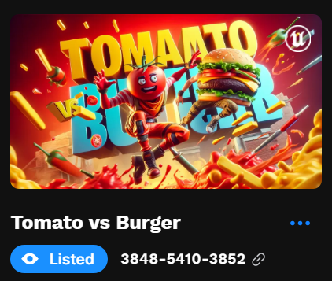

# Hi 👋, I'm Yazan Alsalloum

## Software Developer & Fortnite Island Mapper 🌴 🚀

I'm a passionate second-year software developer with a keen interest in building innovative software and exploring the digital realm. Beyond my enthusiasm for coding, I also dedicate myself to creating fascinating islands in Fortnite, combining creativity with gaming to produce immersive experiences. Join me on this exciting journey at the intersection of coding and virtual world creation.

### Connect with me:

 
School Email: d273050@edu.curio.nl

 

### Languages and Tools:

- **Programming Languages:** C#, JavaScript, Python, PHP
- **Frameworks:** Laravel
- **Databases:** MySQL
- **Other Tools:** Git, HTML5, CSS3, Unreal Engine 5 fortnite, Blender

## Fortnite Map Creations

I'm also deeply involved in designing and mapping out captivating islands on Fortnite. Below is a selection of my custom-designed Fortnite islands, each showcasing my dedication and creativity in game design.

### Map Screenshots

<!-- Adjust the width as needed -->

  
  
  
  
  
  
  
  

